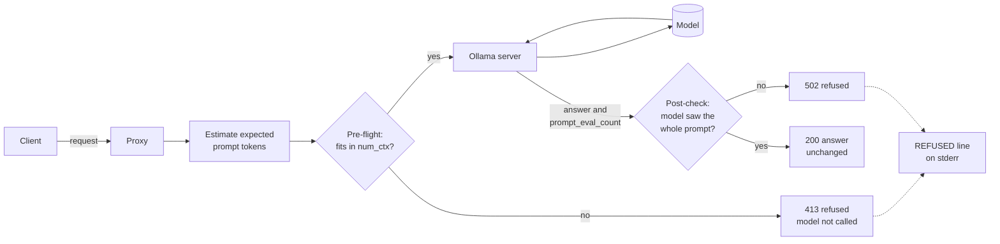

# ollama-truncation-guard

A small proxy that refuses any Ollama answer built on a prompt the model never fully saw.

This tool integrates with a running machine-learning model server (Ollama) as a guarded inference proxy. It enforces a correctness check on every inference that passes through it.

It is under 200 lines of Python, uses only the standard library, and has zero dependencies.

## Why this exists

On a local GPU server, a 120B open-weights model was served by Ollama with `num_ctx` set to 131,072 tokens. It was sent a prompt of about 137,000 tokens, and later one of about 168,000. Both times Ollama reported `prompt_eval_count` = 65,538. That is about half the window, and well under half of what was sent.

There was no error. There was no warning in the API response. The model answered fluently and confidently from the part of the prompt it kept.

The likely cause is llama.cpp's context shift, which keeps a head and roughly half the window when the input overflows [Likely]. Whatever the cause, `prompt_eval_count` is the only signal the API gives. So this proxy checks it, at the one place every request passes through.

## How it works



1. A client sends `/api/generate` or `/api/chat` to the proxy instead of to Ollama.
2. The proxy works out how many prompt tokens to expect. It uses the client's own count if one is sent, or a conservative estimate.
3. If the prompt cannot fit in the context window, the proxy answers 413 at once. The model is never called, which saves GPU time.
4. Otherwise the request goes to Ollama unchanged, and Ollama runs the model.
5. Ollama returns the answer with `prompt_eval_count`, the number of prompt tokens the model actually evaluated.
6. The proxy compares that count with what it expected. If the model saw materially less, the answer is refused with 502. Otherwise it is returned unchanged.
7. Every refusal writes one `REFUSED` line to stderr with both numbers.

All other paths, such as `/api/tags` and `/api/show`, are forwarded verbatim and are not checked.

## Quickstart

Requirements: Python 3.10 or newer, and a running Ollama server. There is nothing to install.

```bash
git clone https://github.com/Adrian-I-lab/ollama-truncation-guard.git
cd ollama-truncation-guard
python3 proxy.py --num-ctx 8192
```

The proxy listens on port 11435 and forwards to Ollama on port 11434. In another terminal:

```bash
curl -s http://127.0.0.1:11435/api/generate \
  -d '{"model": "<your model>", "prompt": "Why is the sky blue?", "stream": false}'
```

To guard an existing client, change only its base URL from `http://127.0.0.1:11434` to `http://127.0.0.1:11435`. For example, many clients read `OLLAMA_HOST` [Likely]:

```bash
OLLAMA_HOST=http://127.0.0.1:11435 <your client>
```

## Configuration

| Flag | Default | Meaning |
|---|---|---|
| `--upstream` | `http://127.0.0.1:11434` | Base URL of the Ollama server. |
| `--host` | `127.0.0.1` | Address the proxy binds. Keep it on localhost. |
| `--port` | `11435` | Port the proxy binds. |
| `--num-ctx` | none | Context window to assume when a request sets no `options.num_ctx`. |
| `--tolerance` | `0.85` | Refuse when `prompt_eval_count` is below this fraction of the expected tokens. `0` turns the ratio check off. |
| `--chars-per-token` | `6.0` | Divisor for the token estimate. Larger means a lower, safer estimate. |
| `--stream-mode` | `buffer` | `buffer` or `passthrough`. See Streaming. |

A client that knows its exact token count can send it in a header. The proxy then trusts it instead of estimating.

```
X-Expected-Prompt-Tokens: 137000
```

## Responses

| Status | When | Model called? |
|---|---|---|
| 200 | The check passed. The upstream body is returned unchanged. | Yes |
| 413 | The expected tokens already exceed `num_ctx`. | No |
| 502 | `prompt_eval_count` shows truncation, or is missing. Also used when Ollama cannot be reached. | Yes |

Upstream errors, such as a 404 for an unknown model, are passed through with their own status.

These bodies were captured from real test runs against the fake server in `tests/fake_ollama.py`.

200, honest upstream:

```json
{"model": "demo", "done": true, "response": "fake answer", "eval_count": 3, "prompt_eval_count": 1500}
```

413, pre-flight refusal:

```json
{"error": "prompt cannot fit; model not called", "expected_tokens": 2500, "num_ctx": 2048,
 "reasons": ["expected 2500 tokens exceed num_ctx 2048"]}
```

502, half-window truncation:

```json
{"error": "prompt truncation detected; answer refused", "expected_tokens": 1500, "num_ctx": 2048,
 "prompt_eval_count": 1026,
 "reasons": ["prompt_eval_count 1026 is below 0.85 x expected 1500",
             "half-window signature: prompt_eval_count 1026 is about num_ctx 2048 / 2"]}
```

The matching stderr line:

```
REFUSED path=/api/generate expected_tokens=1500 num_ctx=2048 prompt_eval_count=1026 reasons="prompt_eval_count 1026 is below 0.85 x expected 1500; half-window signature: prompt_eval_count 1026 is about num_ctx 2048 / 2"
```

## How expected tokens are counted

The proxy needs a number to compare against. It takes the best one it has.

1. **The header, exact.** `X-Expected-Prompt-Tokens` comes from a client that ran the model's own tokenizer. It is trusted as given.
2. **An estimate, deliberately low.** Otherwise the proxy divides the prompt length in characters by 6. English prose runs nearer 4 characters per token [Likely], so dividing by 6 under-counts on purpose. The estimate is a lower bound, so estimation error alone should not make an honest prose prompt look truncated. For `/api/generate` the text counted is `system` plus `prompt`. For `/api/chat` it is every message's `content`. The chat template adds tokens on top, which only makes the bound safer.

The answer is refused when any of these hold.

- **Ratio.** `prompt_eval_count` is below `tolerance` x expected. The default tolerance is 0.85.
- **Half-window signature.** `prompt_eval_count` is within 8 tokens of `num_ctx / 2`, and the expected count is more than 10 % higher. This catches the pattern described above even when the estimate is weak.
- **Count exceeds the window.** `prompt_eval_count` is larger than `num_ctx`. That is impossible, so the response cannot be trusted.
- **Missing count.** `prompt_eval_count` is absent, for example when a stream is cut before its final line. Truncation cannot then be ruled out.

`num_ctx` comes from the request's `options.num_ctx`, else from `--num-ctx`. If neither is known, the pre-flight, half-window, and window checks are skipped. The proxy does not guess Ollama's own default, because it has changed between versions [Likely].

Ollama's tokenize endpoint is not relied on. On Ollama 0.40.2, `POST /api/tokenize` returned 404.

## Streaming

Ollama streams by default. It sends newline-delimited JSON and reports `prompt_eval_count` only in the final line, the one with `"done": true` [Likely]. So a streamed answer cannot be judged until it has finished.

- **`buffer` (default, safe).** The proxy reads the whole stream, checks the final line, and then replays every line to the client. The client sees the same wire format, only later. A truncated answer never reaches the client. It gets a 502 instead.
- **`passthrough` (low latency).** Lines go to the client as they arrive. Only the final line is held back. If the check fails, that line is replaced with an error line that also carries `"done": true` and both numbers. The client has already seen partial text, so this mode **detects** truncation but cannot **prevent** it. The HTTP status is already 200 by then.

A request with `"stream": false` is checked as a single line in either mode, and is refused with 502.

## Demo

This transcript was produced by running the proxy in front of `tests/fake_ollama.py`, first truncating, then honest. It is real output, not hand-written. It lives in [`docs/demo.txt`](docs/demo.txt).

```text
=== 1. Upstream silently keeps only 600 prompt tokens ===

# terminal 1
$ python3 -m tests.fake_ollama --truncate-to 600
fake Ollama on http://127.0.0.1:11434 truncate_to=600

# terminal 2
$ python3 proxy.py
guarding http://127.0.0.1:11434 on http://127.0.0.1:11435

# terminal 3: a 6,000-character prompt at num_ctx 2048, so about 1,000 tokens are expected
$ python3 -c 'import json; print(json.dumps({"model": "demo", "prompt": "x" * 6000, "stream": False, "options": {"num_ctx": 2048}}))' > request.json

$ curl -s -w '\nHTTP %{http_code}\n' http://127.0.0.1:11435/api/generate -d @request.json
{"error": "prompt truncation detected; answer refused", "expected_tokens": 1000, "num_ctx": 2048, "prompt_eval_count": 600, "reasons": ["prompt_eval_count 600 is below 0.85 x expected 1000"]}
HTTP 502

# terminal 2 (proxy stderr)
REFUSED path=/api/generate expected_tokens=1000 num_ctx=2048 prompt_eval_count=600 reasons="prompt_eval_count 600 is below 0.85 x expected 1000"

=== 2. Same request, honest upstream ===

# terminal 1 (restarted)
$ python3 -m tests.fake_ollama
fake Ollama on http://127.0.0.1:11434 truncate_to=None

# terminal 3
$ curl -s -w '\nHTTP %{http_code}\n' http://127.0.0.1:11435/api/generate -d @request.json
{"model": "demo", "done": true, "response": "fake answer", "eval_count": 3, "prompt_eval_count": 1500}
HTTP 200
```

The full transcript also shows a 413 pre-flight refusal.

## Tests

```bash
python3 -m unittest discover -s tests -v
```

Measured on the current code: 43 tests, 41 passed, 2 skipped, 0 failed. The 2 skipped tests need a real Ollama server (see below).

The tests use `tests/fake_ollama.py`, a standard-library fake of Ollama that truncates on purpose. It counts `len(text) // 4` tokens and can report the true count, a fixed count, the half-window pattern, or no count at all. Each key test sends an identical request twice.

- Against a fake that keeps only 600 tokens, the proxy must refuse with 502 and log both numbers.
- Against an honest fake, the same request must succeed with 200 and the upstream body.
- A control runs the truncating fake with the guard switched off (`--tolerance 0`, no `num_ctx`). The truncated answer gets through. This proves the guard, not the fake, is what refuses.

This fail-then-pass pattern is repeated for non-streamed and streamed requests, both stream modes, `/api/chat`, the half-window signature, a missing count, the pre-flight 413 (where the fake must record zero calls), and the header override.

To run the two real-server tests against your own Ollama and a small model:

```bash
OLLAMA_URL=http://127.0.0.1:11434 OTG_MODEL=<a small model> python3 -m unittest tests.test_real_ollama -v
```

Measured on Ollama 0.40.2 with `qwen2.5:0.5b`, both tests passed. A direct request of about 2,500 tokens at `num_ctx` 512 came back with `prompt_eval_count` 258, about half the window. The same request through the proxy, with `X-Expected-Prompt-Tokens: 500`, was refused with 502 and both reasons.

The line budget is enforced by a gate that counts physical lines, so blanks and comments count:

```bash
bash scripts/check_lines.sh
```

Measured: `python_lines_excluding_tests=197 max=199 files=2` (`guard.py` 52 lines, `proxy.py` 145 lines). CI runs both commands on Python 3.10 and 3.12.

## Limits

- **The estimate is a ratio, not a tokenizer.** Code, non-English text, and base64 tokenise very differently from prose. Send `X-Expected-Prompt-Tokens` when you need an exact count.
- **Prompt caching could cause false positives.** Ollama reuses its cache for a shared prompt prefix. If `prompt_eval_count` then counted only new tokens, a long multi-turn chat could look truncated. On Ollama 0.40.2 with `qwen2.5:0.5b`, the same prompt sent twice reported 330 tokens both times. Other versions and multi-turn chats are not measured. `--tolerance 0` turns the ratio check off if it bites.
- **Not everything is counted.** Images, tool schemas, and `format` JSON schemas are not counted.
- **Only two paths are guarded.** `/api/generate` and `/api/chat`. The OpenAI-compatible `/v1/*` endpoints are not supported and are forwarded unchecked.
- **Localhost only.** There is no authentication and no TLS. Do not expose it beyond your own machine.
- **Not a gateway.** It runs one thread per connection. That suits one user and a local model server, which is the whole use case. It is not built for high concurrency.

## Design choices

**Standard library `http.server`, not FastAPI.** A pass-through proxy is not much shorter in FastAPI, because it still needs an HTTP client, an ASGI server, and streaming glue. That is three dependencies for no saving in lines. The standard library gives zero dependencies, nothing to vet or pin, and no supply-chain surface. A reviewer can run it with `python3 proxy.py`. FastAPI would win on async concurrency and generated API docs. Neither matters for a single-user local tool.

**`unittest`, not pytest.** CI installs nothing at all.

**`guard.py` holds pure logic, `proxy.py` holds the I/O.** The checks can be tested without a network, and the proxy tests then only need to show the wiring.

## Licence

MIT. See [`LICENSE`](LICENSE).
